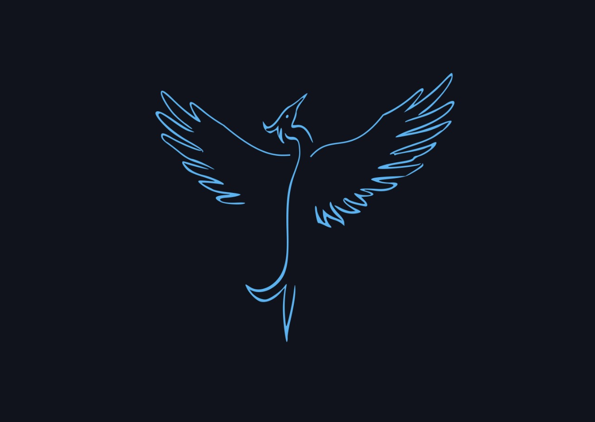

<!--  
<h2 align="center">𝐇𝐞𝐥𝐥𝐨 𝐟𝐞𝐥𝐥𝐨𝐰 <𝚌𝚘𝚍𝚎𝚛𝚜>! </h1> -->
<!--    <h3>👈 My Logo </h3> -->
 

<h2> Hi There </h2>

 

 

<!--     -->
  <samp>
  About Me  
👨‍💻 20 yo   :coffee: Coffee Lover   💻 Linux User   📊 Data Science Enthusiast  
<!--     :house_with_garden: Based in India 🇮🇳  -->
    :school: CS/IT Student from IIIT Bhopal [2024] 
    :email:	tanav.bajaj58@gmail.com  
    :pencil: CV: <a href="https://github.com/tanav2202/tanav2202.github.io/blob/main/assets/tanav_cv.pdf">View Resume</a>  
    :briefcase: LinkedIn:  <a href="https://www.linkedin.com/in/tanav-bajaj/">LinkedIn Profile</a>  
 📓 Kaggle: <a href="https://www.kaggle.com/tanavbajaj">Kaggle Profile</a>  
    :bird: Twitter:  <a href="https://twitter.com/tanav2202/">Twitter</a>  
   📱 Portfolio :  <a href="https://tanav.xyz">tanav.xyz</a>    

</samp>

<!--  

 -->
 
<!--    -->
<!--  
 
 

  -->
 
 
<!--  
 
 
  
 
  
  -->
 

<!--  <h2 align="center" > My Laptop looks like this </h2> -->

<!--
<h3 align="center">Connect with me:</h3>

 

 

<h3 align="center">My Tech Stack :</h3>

          

--->

  
GitHub Statistics (click )

 

<!-- 
&nbsp;
? -->

<!--  -->

<!--

  

-->
